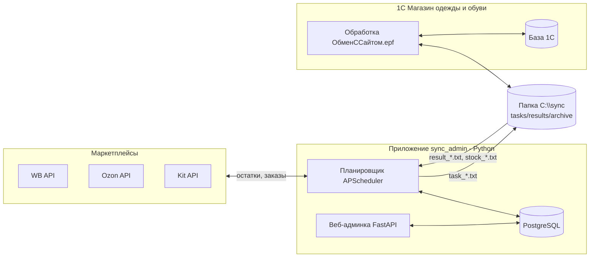
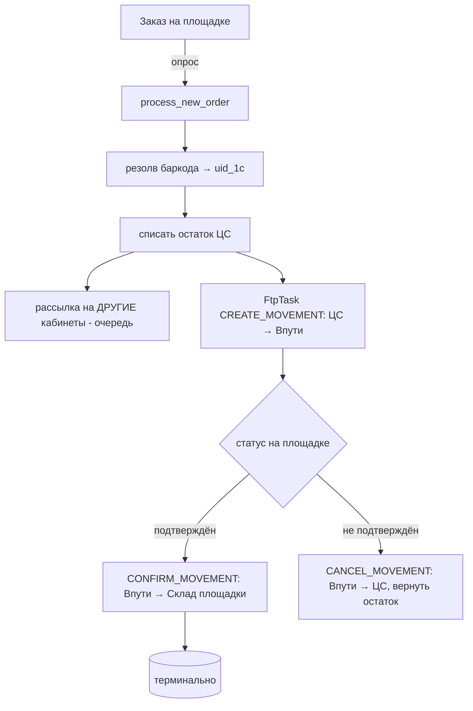

# Архитектура и логика проекта

Подробное описание системы синхронизации остатков между 1С и маркетплейсами:
из чего построена, как течёт информация, почему сделано именно так.

---

## 1. Назначение и главный принцип

Система держит **один физический остаток** товара (центральный склад 1С, «ЦС»)
и корректно показывает его на нескольких каналах продаж (**WB, Ozon, Kit/Яндекс**,
несколько кабинетов на площадку), принимает заказы и отражает их движением товара
в 1С — так, чтобы **не продать одну и ту же вещь дважды** на разных площадках.

Главный принцип: **денежный путь детерминирован**. Приём заказа, списание остатка,
рассылка на площадки, задания в 1С — это точные операции без «угадывания». Никакого
ИИ в этом контуре.

Единица учёта — **размер-цвет SKU** (в 1С это характеристика номенклатуры). У одного
SKU может быть несколько баркодов (пул); заказы резолвятся поштучно по баркоду.

---

## 2. Общая архитектура

Два компонента на одном Windows-сервере, обмен через локальную папку `C:\sync`.



- **Веб-админка** — оператор настраивает ключи, мэппинг, что и куда транслировать.
- **Планировщик** — фоновые циклы (опрос заказов, рассылка остатков, сверка, канал 1С).
- **Обработка 1С** — по файлам-заданиям создаёт перемещения и отдаёт остатки ЦС.
- **Папка `C:\sync`** — транспорт между приложением и 1С (без FTP; всё локально).

---

## 3. Модель данных (ключевые сущности)

| Сущность | Смысл | Ключевые поля |
|---|---|---|
| **Product** | размер-цвет SKU (зеркало номенклатуры 1С) | `uid_1c` (PK), `stock_on_hand` (остаток ЦС), `reserve`, `transmit_override`, `broadcast_enabled`, `broadcast_active_since` |
| **Barcode** | баркод → товар (пул баркодов SKU) | `barcode`, `uid_1c` |
| **PlatformAccount** | кабинет площадки (ИП/ООО с токеном) | `platform`, `name`, `warehouse_id`, `is_active`, `dispatch_enabled`, `consecutive_failures` |
| **ApiCredential** | ключ доступа кабинета | `field_name`, `encrypted_value` (Fernet) |
| **SyncSetting** | синхронизировать SKU для кабинета | `uid_1c`+`account_id`, `enabled`, `min_threshold`, `has_proposal` |
| **PlatformCatalogItem** | строка каталога кабинета (для идентификаторов) | `account_id`, `barcode`, `external_id`, `article` |
| **DispatchQueueItem** | очередь на отправку остатка | `uid_1c`, `account_id`, `quantity`, `status`, `is_test` |
| **FtpTask** | задание в 1С (перемещение/выгрузка) | `command`, `barcode`, `warehouse_from/to`, `order_id`, `status`, `is_test` |
| **ProcessedOrder** | принятый заказ | `account_id`, `order_id`, `uid_1c`, `status` (processed/confirmed/cancelled) |
| **SyncAnomaly** | аномалия (заказ на невключённый товар и т.п.) | `reason`, `order_id` |
| **ReconciliationLog**, **WorkerHeartbeat**, **AuditLog** | сверка, живость воркеров, аудит | |

Связи: `Product 1—N Barcode`, `Product 1—N SyncSetting`, `PlatformAccount 1—N ApiCredential/SyncSetting/PlatformCatalogItem`.

---

## 4. Ключевые механики (логика)

### 4.1 Мэппинг и пулы SKU
Баркод однозначно ведёт к номенклатуре 1С (`Barcode.uid_1c`). У размер-цвета —
несколько баркодов; они объединяются в пул (union-find по общим баркодам). Сопоставление
площадок между собой и с 1С строится по пересечению пулов (страница «Сопоставление
площадок»). Денежный путь остаётся **поштучным по баркоду** — каждый размер резолвится
своим баркодом.

### 4.2 Остаток и что уходит на площадку
Физический остаток один — `Product.stock_on_hand` (склад ЦС из 1С; **может быть
отрицательным** — пересортица, это не баг). Сколько реально уйдёт на площадку считает
`_quantity_to_send` (app/workers/dispatch.py) в момент отправки, по приоритету:

```
0. Трансляция SKU выключена (broadcast_enabled=False) ─► 0   (снять с продажи)
1. Кабинет не отмечен для товара (SyncSetting.enabled=False) ─► 0 в этот кабинет
2. Рассылка на кабинет на паузе (dispatch_enabled=False) ─► 0
3. Задан порог трансляции (broadcast_offset) ─► max(0, остаток ЦС − порог)
4. Задан ручной override (legacy) ─► max(0, override)
5. Иначе ─► max(0, остаток − резерв); если ≤ порога кабинета ─► 0
```
Единственная реализация — `app/transmit.py` (`explain` для интерфейса,
`quantity_for_account` для рассылки). Раньше лестница была скопирована в трёх
местах и копии разошлись: страница показывала одно, рассылка отправляла другое.

- **Резерв** (`reserve`) — сколько держим у себя, на товар, общий на все каналы.
- **Передаваемый остаток** (`transmit_override`) — ручной запас: **заказы вычитаются
  из него**, отмена возвращает; фоновое обновление остатка из 1С его не сбрасывает.
  NULL = автоматический расчёт.
- **Трансляция** (`broadcast_enabled`) — вкл/выкл на SKU. **По умолчанию ВЫКЛючена** —
  новый товар не льёт остаток, пока оператор явно не включит (безопасный дефолт).
- **Порог трансляции** (`broadcast_offset`, на товар) — постоянное расхождение
  между учётом 1С и реальным складом: `(остаток ЦС на дату пересчёта) − (реально
  найдено)`. Может быть отрицательным. Фиксирован: заказы и сверка двигают только
  остаток, поэтому цифра не дрейфует (в отличие от `transmit_override`).
- **Порог кабинета** (`min_threshold`) — страховой буфер, чтобы не продать последние
  штуки одновременно во всех каналах. Не применяется, когда задан порог трансляции
  или ручной остаток: их оператор задал явно.
- **Пауза кабинета** (`PlatformAccount.dispatch_enabled`) — мастер-переключатель: выкл →
  диспетчер вообще пропускает кабинет (остатки на площадке не трогаем). Переключается по
  площадке или по всем сразу.

### 4.3 Приём заказов и жизненный цикл (order_poller.py)

- Заказ на невключённый для кабинета товар → фиксируется **аномалия** (не молчим).
- Подтверждённый заказ **терминален**: продажу и возврат после подтверждения система не
  обрабатывает (по требованию заказчика).

### 4.4 Рассылка остатков (dispatch.py)
Очередь `DispatchQueueItem` копится (при заказе, смене резерва/override, ручном включении).
Раз в ~минуту `run_dispatch_cycle`: по каждому активному кабинету берёт очередь,
**схлопывает по товару** (только последнее значение за окно), применяет `_quantity_to_send`,
достаёт из каталога кабинета нужный идентификатор (WB — баркод, Ozon — offer_id, Kit —
variant_id) и отправляет батчем. Пауза кабинета (`dispatch_enabled=False`) → пропуск.

### 4.5 Канал с 1С — локальная папка (ftp_channel.py → LocalExchange)
Обмен файлами через `C:\sync`, UTF-8, разделитель `|`, публикация атомарная (`.part`
→ rename).

| Файл | Направление | Смысл |
|---|---|---|
| `task_*.txt` | приложение → 1С | команды: CREATE/CONFIRM/CANCEL_MOVEMENT, EXPORT_STOCK_ON_HAND, EXPORT_BARCODES, EXPORT_STOCK_ON_DATE |
| `result_*.txt` | 1С → приложение | по каждому order_id: `OK|номер` или `ERROR|текст` |
| `stock_*.txt` | 1С → приложение | выгрузка остатков ЦС: `uid|артикул|наименование|кол-во|баркоды` |
| `ondate_*.txt` | 1С → приложение | остатки ЦС **на заданное число** — только справка для страницы «Остатки на дату»: в остаток товара и в сверку не попадают |

Приложение собирает задания из `FtpTask`, кладёт файл, забирает результаты и закрывает
задания; просроченные без ответа помечает `timeout` (сигнал сбоя канала/1С).

### 4.6 Сверка (reconciliation.py)
Периодически запрашивает выгрузку остатков ЦС, сравнивает с тем, что «должно быть»
(с учётом того, что ещё «в пути» на канале), классифицирует дельту и при необходимости
ставит корректирующую рассылку. Пересортица (отрицательный остаток) отправляется как 0,
это штатно.

### 4.7 Стабильность и эксплуатация
- **Retry с бэкоффом** (http_retry.py) — 429/5xx повторяются с уважением к `X-Ratelimit-
  Retry` (WB) / `Retry-After`.
- **Автовыключатель** (circuit_breaker.py) — 5 подряд сбоев опроса → кабинет сам
  отключается (`is_active=False`), сбрасывается вручную.
- **/health** — 200 если все воркеры отчитались вовремя, 503 если протух/упал или ни
  один не отчитался.
- **Диагностика/Тестирование** — прогон одного товара тем же кодом, что и прод
  (`is_test=True` записи никогда не уходят в реальный файл/на площадку).

---

## 5. Фоновые воркеры и расписание (scheduler.py)

| Воркер | Что делает | Интервал (ориентир) |
|---|---|---|
| `poll_orders_account_<id>` | приём заказов + подтверждения + отмены по кабинету | ~2 мин |
| `dispatch` | рассылка остатков из очереди | ~30–60 с |
| `ftp_send` / `ftp_receive` | положить задания / забрать результаты (папка) | ~1 мин |
| `ftp_send` (export) | запрос выгрузки остатков ЦС | ~1 ч |
| `catalog_poll_account_<id>` | обновление каталога кабинета (индикатор ⚡) | ~сутки |
| `reconcile_accounts` | сверка | периодически |

Планировщик — **отдельный процесс** от веба (`python -m app.workers.scheduler`), на
Windows — служба `sync_admin_worker`.

---

## 6. Веб-интерфейс (страницы)

| Страница | Роль |
|---|---|
| **API-ключи** | кабинеты, токены (шифруются), проверка подключения, список нужных складов 1С |
| **Мэппинг** | баркод → номенклатура, конфликты сопоставления |
| **Сопоставление площадок** | пулы SKU между площадками и 1С |
| **Товары и остатки** | одна строка на SKU: остаток ЦС, резерв, порог трансляции, выключатель трансляции, дата старта и по каждому кабинету — галочка, порог и **число, которое реально уйдёт** (с причиной, если 0). Массовая правка, Excel, пауза рассылки по площадкам |
| **Аномалии** | заказы на невключённые товары и пр. |
| **Остатки на дату** | запрос в 1С «сколько лежало на ЦС такого-то числа» и просмотр ответа: справка для разбора расхождений, на площадки не влияет |
| **Диагностика / Тестирование** | живость, ручной прогон, симуляция заказа/отмены |

Стек: FastAPI + Jinja2 + HTMX (без сборки фронта), PostgreSQL, без внешних UI-фреймворков.

---

## 7. 1С-сторона (обработка ОбменССайтом)

Внешняя обработка `.epf` крутится в 1С (кнопкой/по расписанию), точка входа
`ВыполнитьОбмен()`: читает `task_*.txt`, выполняет команды, пишет результаты и выгрузку
остатков, архивирует задания. Использует реальные метаданные базы (регистр `Штрихкоды`
с полями `Владелец`/`ХарактеристикаНоменклатуры`, регистр `ТоварыНаСкладах`, документ
`ПеремещениеТоваров`, справочник `Склады`).

Карта складов:

| Роль | WB | Ozon | Kit (магазин «Сайт AWER») |
|---|---|---|---|
| Источник | `ЦС Склад` | `ЦС Склад` | `ЦС Склад` |
| «В пути» | `Wildberries_Впути` | `OZON_Впути` | `AWER в пути` |
| Склад площадки | `Wildberries_Склад_FBO` | `OZON_Склад` | `Сайт AWER` |

Детали — в `1c/ТЗ_ОбменССайтом.md` и `1c/README.md`.

---

## 8. Безопасность

- **API-ключи** шифруются в БД (Fernet, `SECRETS_ENCRYPTION_KEY`), в UI маскируются.
- **Вход** — bcrypt-хэши, сессии на подписанной cookie, **блокировка после 10 неверных
  попыток** на 30 мин.
- **Граница is_test** — тестовые записи (страница «Тестирование») никогда не попадают в
  реальный файл для 1С и не уходят на площадку.
- **Секреты** (`.env`, `*.db`) не коммитятся; локальный HTTP по умолчанию (за HTTPS-прокси
  — `SESSION_COOKIE_SECURE=1`).

---

## 9. Проектные решения (почему так)

- **Локальная папка вместо FTP** — 1С и приложение на одной машине, поэтому файловый
  обмен проще и надёжнее сети (нет службы FTP, портов, учёток).
- **Остаток один (ЦС), каналов много** — модель «кабинет ≠ площадка»: у WB несколько ИП,
  но резерв и склад «в пути» общие на площадку.
- **Безопасные дефолты** — трансляция и синхронизация по умолчанию ВЫКЛючены: система
  ничего не отправляет на площадки, пока оператор явно не включит нужное.
- **Один код для теста и прода** — страница «Тестирование» вызывает те же функции, что
  живой цикл; успешный тест = реальная гарантия.
- **Детерминизм денежного пути** — никакого ИИ в приёме заказов/списании/рассылке.

---

## 10. Развёртывание (кратко)

Windows-сервер, один скрипт `deploy/install_windows.ps1` (venv, зависимости, `.env` с
секретами, БД, миграции, админ, службы `sync_admin_web`/`sync_admin_worker` через NSSM).
Подробно — `deploy/README_WINDOWS.md`. Обмен — папка `C:\sync` (совпадает с 1С).

---

## 11. Что НЕ доделано

1. HTTP-клиенты площадок не проверены на **живых ключах**.
2. **Детект «заказ подтверждён»** по живым API (WB/Ozon/Kit) — не заполнен; без него
   движение `Впути → Склад` в проде не создаётся.
3. **Backfill «задним числом»** (Фаза 2) — поле `broadcast_active_since` есть, подтягивание
   отгрузок маркетплейсов с даты не реализовано.
4. **Автозапуск обработки 1С** по расписанию — согласовать способ.

---

## 12. Карта репозитория

```
app/
  main.py            — точка входа, роуты, сессии
  models.py          — модель данных (SQLAlchemy)
  crypto.py          — шифрование ключей
  routers/           — веб-страницы (api_keys, mapping, platform_matching,
                       products, anomalies, diagnostics, testing, health, auth)
  workers/           — фон: order_poller, dispatch, ftp_channel (LocalExchange),
                       reconciliation, catalog_*, platform_clients/{wb,ozon,kit},
                       scheduler, http_retry, circuit_breaker
  templates/         — Jinja2 + HTMX
alembic/versions/    — миграции БД
tests/               — 452 теста (pytest)
deploy/              — install_windows.ps1, README_WINDOWS.md, (+ Linux-вариант)
1c/                  — ОбменССайтом_МодульОбъекта.txt, ТЗ, README (протокол)
ПЕРЕДАЧА.md          — единая инструкция для программиста
АРХИТЕКТУРА.md       — этот документ
```
